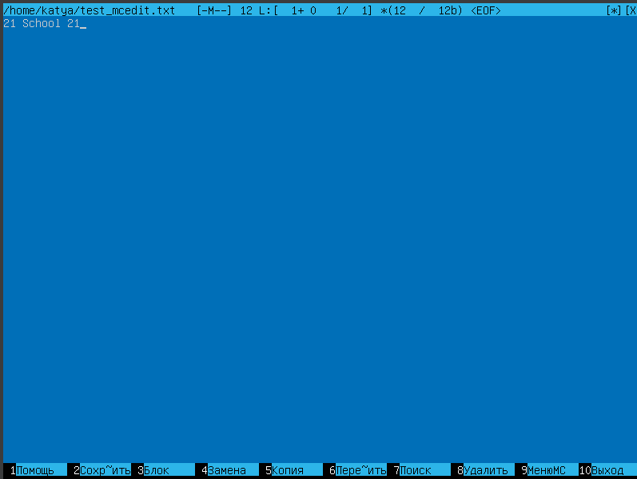
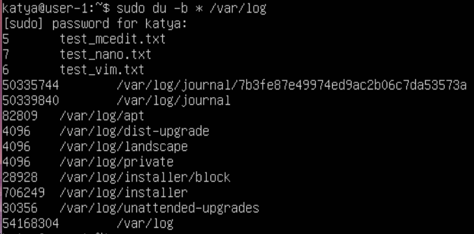
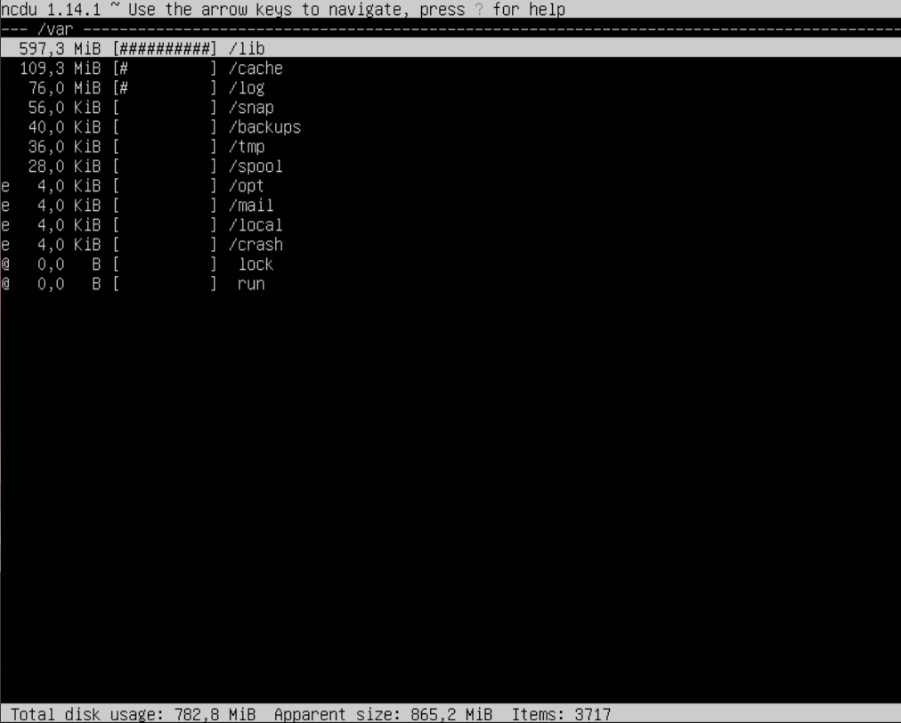
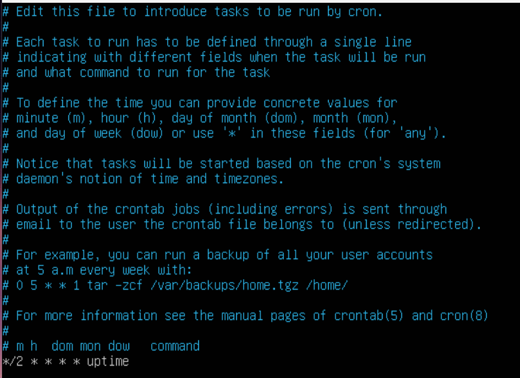

Part 1. Установка ОС
--------------------
1.  Установка Ubuntu 20.04 Server LTS
2.  Проверка версии по команде  `cat /etc/issue.`

Part 2. Создание пользователя
-----------------------------
1.  Команда создания нового пользователя и добавления его в группу adm: `sudo useradd -G adm guest1`

2.  При выполнении команды `cat /etc/passwd` в конце видны пользователи:

* katya - пользователь, созданный при установке

* guest1 - пользователь, созданный с помощью команды из пункта 1.

3. Выведем наглядно участников группы adm:

Part 3. Настройка сети ОС
-------------------------

1. Поменять название машины на название "user-1"

2. Установить временную зону, соответствующую вашему текущему местоположению.

3. Вывести названия сетевых интерфейсов

**loopback (коротко говоря lo)** — это аппаратный или программный метод, который направляет полученный сигнал или данные обратно отправителю. Он используется как дополнительное средство в исправлении проблем физического соединения.

4. Получить ip адрес устройства, на котором мы работаем, от DHCP сервера.

**DHCP** - это клиент-серверный протокол динамической конфигурации хоста (Dynamic Host Configuration Protocol), с помощью которого в ИТ-инфраструктуре сетевые параметры каждого нового устройства прописываются автоматически. Использование DHCP существенно упрощает работу системных администраторов в случаях расширения сети.

5. Определить и вывести на экран внешний ip-адрес шлюза (ip) и внутренний IP-адрес шлюза, он же ip-адрес по умолчанию (gw).

6. Задать статичные (заданные вручную, а не полученные от DHCP сервера) настройки ip, gw, dns (использовать публичный DNS серверы, например 1.1.1.1 или 8.8.8.8).

7. Перезагрузить виртуальную машину. Убедиться, что статичные сетевые настройки (ip, gw, dns) соответствуют заданным в предыдущем пункте.

8. Успешно пропинговать удаленные хосты 1.1.1.1 и ya.ru

Part 4. Обновление ОС
---------------------

1. Обновление системы командами `apdate` и `upgrade`

Part 5. Использование команды sudo
----------------------------------

1. **Команда sudo** ( substitute user and do, подменить пользователя и выполнить ) позволяет строго определенным пользователям выполнять указанные программы с административными привилегиями без ввода пароля суперпользователя root.

2. Разрешить пользователю, созданному в Part 2, выполнять команду sudo.

Сначала зададим пароль пользователю guest1 через команду `sudo passwd guest1` 

Part 6. Установка и настройка службы времени
--------------------------------------------

1. Настроить службу автоматической синхронизации времени так, чтобы `NTPSynchronized=yes`

Part 7. Установка и использование текстовых редакторов
-------------------------------------------------------

* Установка текстового редактора vim `sudo apt install vim`
* Установка текстового редактора nano `sudo apt install nano`
* Установка текстового редактора mcedit `sudo apt install mc`

1. Создание файла test_vim.txt `sudo vim test_vim.txt`, для выхода из редактора с сохранением `Esc`, `:`, `wq`

* Создание файла test_vim.txt `sudo vim test_vim.txt`, для выхода из редактора без сохранения `Esc`, `:`, `q!`

* Вывод содержимого `cat test_vim.txt`

* Поиск и замена c помощью команды `:%s/поиск/замена/g`

2. Создание текстового файла test_nano.txt `sudo nano test_nano.txt`, для выхода из редактора с сохранением `Ctrl+0`, `Ctrl+x`

* Создание текстового файла test_nano.txt `sudo nano test_nano.txt`, для выхода из редактора без сохранения через команду `No`

* Вывод содержимого `cat test_nano.txt`

* Поиск и замена с помощью `Ctrl-W` и `Ctrl-\`

3. Создание файла test_mcedit.txt, `sudo mcedit test_mcedit.txt`, для редакттрования, выходим c сохранением `F-2`, `F-10`

* Создание файла test_mcedit.txt, `sudo mcedit test_mcedit.txt`, для редакттрования, выходим без сохранения `F-10`

* Вывод содержимого `cat test_mc.txt`

* Поиск и замена с помощью `F7` и `F4`

Part 8. Установка и базовая настройка сервиса SSHD
--------------------------------------------------

* Установить пакет `openssh sudo apt install openssh-server`

* Добавьте пакет SSH-сервера в автозагрузку `sudo systemctl enable ssh`

* Проверьте работу SSH `systemctl status sshd`

* Изиенение порта на 2022 `sudo vim /etc/ssh/sshd_config`

* С помощью команды `ps` показать наличие `sshd`

* ключ -С который фильтрует по имени процесса -A, -e, (a) - выбрать все процессы; -a - выбрать все процессы, кроме фоновых; -d, (g) - выбрать все процессы, даже фоновые, кроме процессов сессий; -N - выбрать все процессы кроме указанных; -С - выбирать процессы по имени команды; -G - выбрать процессы по ID группы; -p, (p) - выбрать процессы PID; --ppid - выбрать процессы по PID родительского процесса; -s - выбрать процессы по ID сессии; -t, (t) - выбрать процессы по tty; -u, (U) - выбрать процессы пользователя. Опции форматирования: -с - отображать информацию планировщика; -f - вывести максимум доступных данных, например, количество потоков; -F - аналогично -f, только выводит ещё больше данных; -l - длинный формат вывода; -j, (j) - вывести процессы в стиле Jobs, минимум информации; -M, (Z) - добавить информацию о безопасности; -o, (o) - позволяет определить свой формат вывода; --sort, (k) - выполнять сортировку по указанной колонке; -L, (H)- отображать потоки процессов в колонках LWP и NLWP; -m, (m) - вывести потоки после процесса; -V, (V) - вывести информацию о версии; -H - отображать дерево процессов;

* Вывод команды netstat -tan должен содержать

-n служит для печати IP-адресов вместо имен хостов; -a показывает состояние всех сокетов; -t показывает только tcp соединения; Значения столбцов: Proto - протокол, используемый сокетом; Recv-Q - количество байтов, не скопированных пользовательской программой, подключенной к этому сокету; Local Address - локальный адрес (имя локального хоста) и номер порта сокета Foreign Address - удаленный адрес (имя удаленного хоста) и номер порта сокета State - состояние сокета 0.0.0.0 в этом контексте означает "все IP-адреса на локальной машине"

Part 9. Установка и запуск утилиты top и htop.
----------------------------------------------
* Установить и запустить утилиты top и htop `sudo apt-get install top htop`

1. Вызов команды `top`

* uptime: 19 min

* количество авторизованных пользователей: 1

* общая загрузка системы: 0,00 0,00 0,01

* общее количество процессов: 96

* загрузка cpu: 0,00

* загрузка памяти: 152,1

* pid процессора занимающего больше всего памяти `shift + m` 663 root

* pid процесса, занимающего больше всего процессорного времени: 1066

2. Вызов команды `htop`

* Отсортированный по **PID**:

* Отсортированный по **PERCENT_CPU**:

* Отсортированный по **PERCENT_MEM**:

* Отсортированный по **TIME**:

* Отчёт отфильтрованный по sshd:

* Вывод процесса `syslog`, с помощью поиска:

* Добавление вывода `hostname`, `clock` и `uptime`

Part 10. Использование утилиты fdisk
------------------------------------

* Disk model: VBOX HARDDISK
* 25 GiB, 26843545600 bytes
* 52428800 sectors
* Swap: 0B

Part 11. Использование утилиты df
---------------------------------

1. Запустить команду `df`

* size 11758760
* used 4642228
* available 5072736
* Use% 48%
* 1k-blocks

2. Запустить команду `df -Th`

* size 12G
* used 5.1G
* avail 5.6G
* Use% 48%
* Type ext4

Part 12. Использование утилиты du
---------------------------------

1. Запустите команду `du`

2. Вывести размер папок /home, /var, /var/log (в байтах, в человекочитаемом виде)

3. Вывести размер всего содержимого в /var/log

Part 13. Установка и использование утилиты ncdu
-----------------------------------------------

1. Устанавливаем утилиту `ncdu sudo apt install ncdu`

2. Вывести размер папок /home, /var, /var/log.

Part 14. Работа с системными журналами
--------------------------------------

1. Написать в отчёте время последней успешной авторизации, имя пользователя и метод входа в систему.

* Время авторизации: 4 мая 21:29

* Имя пользователя: katya

* Метод входа в систему: tty1 

2. Перезапустить службу SSHd: `sudo /etc/init.d/ssh restart`

Part 15. Использование планировщика заданий CRON
------------------------------------------------

1. Используя планировщик заданий, запустите команду uptime через каждые 2 минуты:

2. Найти в системных журналах строчки (минимум две в заданном временном диапазоне) о выполнении.

3. В отчёт вставьте скрин со списком текущих заданий для CRON.

4. Удалите все задания из планировщика заданий

