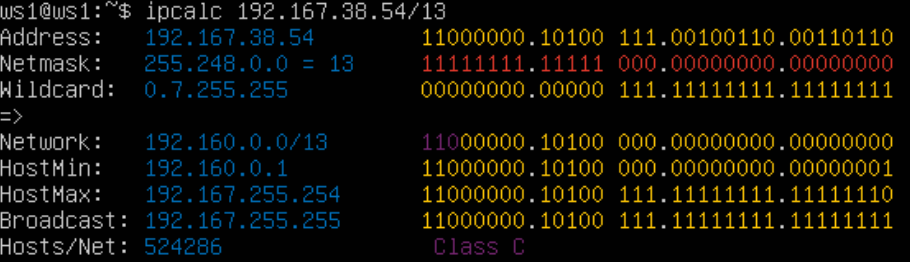
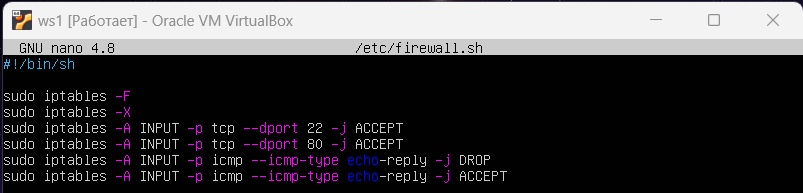
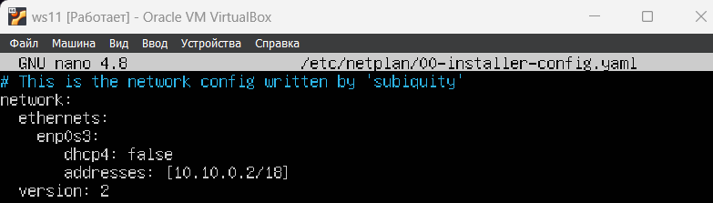
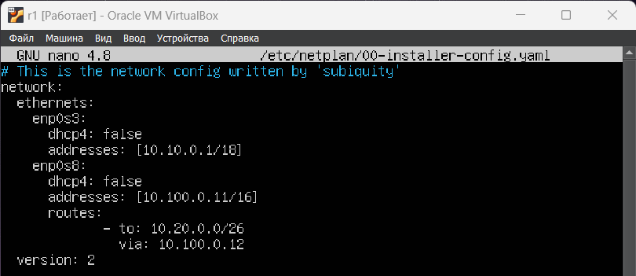
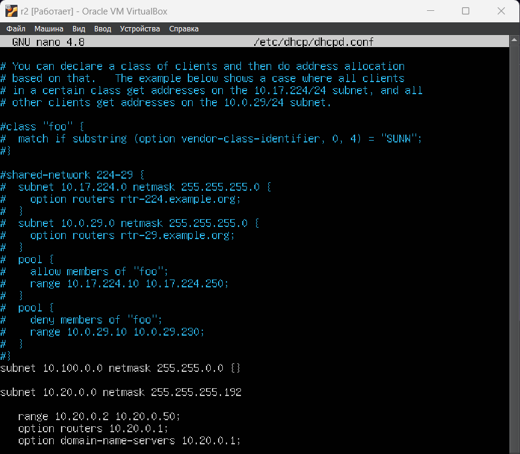
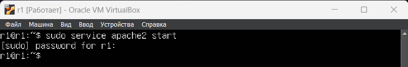
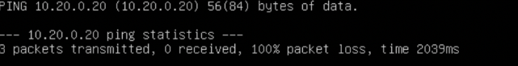

Part 1. Инструмент ipcalc
-------------------------
1. Поднять вирутальную машину ws1

* Устанавливаем ipcalc `sudo apt install ipcalc`

2. Сети и маски

Определить и записать в отчет:

* **Адрес сети 192.167.38.54/13:** 192.160.0.0/13

* **Перевод маски 255.255.255.0 в перфиксную и двоичнуюзапись:** /24, 11111111.11111111.11111111. 00000000 соответственно

* **Перевод /15 вобычную и двоичную:** 255.254.0.0, 11111111.11111110.00000000. 00000000 соответственно

* **Перевод 11111111.11111111.11111111.11110000 в обычную и перфиксную:** 255.255.255.240, /28 соответственно

* Минимальный и максимальный хост в сети 12.167.38.4 при масках: /8, 11111111.11111111.00000000.00000000, 255.255.254.0 и /4:

**/8:** 12.0.0.1 - 12.255.255.254

**11111111.11111111.00000000.00000000:** 12.167.38.1 - 12.167.38.254

**/255.255.254.0:** 12.167.38.1 - 12.167.39.254

**/4:** 1 - 254

3. localhost

* Определить и записать в отчёт, можно ли обратиться к приложению, работающему на localhost, со следующими IP: 194.34.23.100, 127.0.0.2, 127.1.0.1, 128.0.0.1

**localhost** - это имя хоста, которое обозначает текущее устройство, используемое для доступа к нему. Он используется для доступа к сетевым службам, работающим на хосте через интерфейс обратной петли (loopback). Стандарты сети IPv4 резервируют весь блок адресов 127.0.0.0/8 (более 16 миллионов адресов) для целей обратной петли (loopback). То есть, можно обратиться к приложению, работающему на localhost, только с IP-адресов в диапазоне 127.0.0.0/8. Это означает, что: 

**могут:** 127.0.0.2, 127.1.0.1

**не могут:** 194.34.23.100, 128.0.0.1

4. Диапазоны и сегменты сетей

* Какие из перечисленных IP можно использовать в качестве публичного, а какие только в качестве частных: 10.0.0.45, 134.43.0.2, 192.168.4.2, 172.20.250.4, 172.0.2.1, 192.172.0.1, 172.68.0.2, 172.16.255.255, 10.10.10.10, 192.169.168.1

В IPv4 существуют три диапазона IP-адресов, зарезервированных для частных сетей:

10.0.0.0 - 10.255.255.255

172.16.0.0 - 172.31.255.255

192.168.0.0 - 192.168.255.255

Из перечисленных IP-адресов, следующие являются **частными**: 10.0.0.45, 192.168.4.2, 172.20.250.4, 10.10.10.10

Остальные IP-адреса являются **публичными**: 134.43.0.2, 172.0.2.1, 192.172.0.1, 172.68.0.2, 192.169.168.1

* Какие из перечисленных IP адресов шлюза возможны у сети 10.10.0.0/18: 10.0.0.1, 10.10.0.2, 10.10.10.10, 10.10.100.1, 10.10.1.255

Сеть 10.10.0.0/18 имеет диапазон IP-адресов от 10.10.0.0 до 10.10.63.255. Шлюз обычно находится внутри этого диапазона адресов, поэтому из перечисленных IP-адресов **возможными** шлюзами для сети 10.10.0.0/18 являются: 10.10.0.2, 10.10.10.10, 10.10.1.255.

Part 2. Статическая маршрутизация между двумя машинами
------------------------------------------------------
1. Поднять две виртуальные машины ws1 и ws2. С помощью команды `ip a` посмотреть существующие сетевые интерфейсы.

* Описать сетевой интерфейс, соответствующий внутренней сети, на обеих машинах и задать следующие адреса и маски: ws1 - 192.168.100.10, маска /16, ws2 - 172.24.116.8, маска /12

* Выполнить команду `sudo netplan apply` для перезапуска сервиса сети

2. Добавление статического маршрута от одной машины до другой и обратно при помощи команды вида `ip r add`

3. Пропиговать соединение между машинами

4. Перезапустить машины

5. Добавить статический маршрут от одной машины до другой с помощью файла etc/netplan/00-installer-config.yaml

6. Запустить на обеих машинах `sudo netplan apply`

7. Пропинговать соединение между машинами

Part 3. Утилита iperf3
----------------------

1. Перевести и записать в отчёт: 8 Mbps в MB/s, 100 MB/s в Kbps, 1 Gbps в Mbps:

* 8 Mbps = 1 MB/s
* 100 MB/s = 819200 Kbps (Kilobit per second)
* 1 Gbps (Gigabit per second) = 1024 Mbps

2. Измерить скорость соединения между ws1 и ws2

Part 4. Сетевой экран
---------------------

1. Создать файл /etc/firewall.sh, имитирующий фаерволл, на ws1 и ws2:

* на ws1 применить стратегию когда в начале пишется запрещающее правило, а в конце пишется разрешающее правило (это касается пунктов 4 и 5)

* на ws2 применить стратегию когда в начале пишется разрешающее правило, а в конце пишется запрещающее правило (это касается пунктов 4 и 5)

* открыть на машинах доступ для порта 22 (ssh) и порта 80 (http)

* запретить echo reply (машина не должна "пинговаться”, т.е. должна быть блокировка на OUTPUT)

* разрешить echo reply (машина должна "пинговаться")

2. Запустить файлы на обеих машинах командами chmod +x /etc/firewall.sh и /etc/firewall.sh

3. Описать разницу между стратегиями, применёнными в первом и втором файлах.

* Разница в том, что если сперва идет запрещающее правило, то оно не перезаписывается потом разрешающим правилом.

3. Утилита nmap Командой ping найти машину, которая не "пингуется", после чего утилитой nmap показать, что хост машины запущен Проверка: в выводе nmap должно быть сказано: `Host is up`

4. Сохранить дампы образов виртуальных машин

Part 5. Статическая маршрутизация сети
--------------------------------------

1. Поднять пять виртуальных машин (3 рабочие станции (ws11, ws21, ws22) и 2 роутера (r1, r2))

2. Настроить конфигурации машин в etc/netplan/00-installer-config.yaml согласно сети на рисунке.

3. Перезапустить сервис сети. Если ошибок нет, то командой ip -4 a проверить, что адрес машины задан верно. 

4. Пропинговать ws22 с ws21. Аналогично пропинговать r1 с ws11.

5. Включение переадресации IP-адресов

*  Выполните команду на роутерах: `sysctl -w net.ipv4.ip_forward=1`

* Откройте файл /etc/sysctl.conf и добавьте в него следующую строку: `net.ipv4.ip_forward = 1`

6. Установка маршрута по-умолчанию

* Настроить маршрут по-умолчанию (шлюз) для рабочих станций. Для этого добавить gateway4 [ip роутера] в файле конфигураций.Вызвать ip r и показать, что добавился маршрут в таблицу маршрутизации

* Пропинговать с ws11 роутер r2 и показать на r2, что пинг доходит. Для этого использовать команду: `tcpdump -tn -i eth1`

7. Добавление статических маршрутов

* Добавить в роутеры r1 и r2 статические маршруты в файле конфигураций.

* Вызвать ip r и показать таблицы с маршрутами на обоих роутерах. Пример таблицы на r1:

* Запустить команды на ws11: `ip r list 10.10.0.0/[маска сети]` и `ip r list 0.0.0.0/0`

Для адреса 10.10.0.0/18 был выбран маршрут, отличный от 0.0.0.0/0, поскольку он является адресом сети и доступен без шлюза.

8. Построение списка маршрутизаторов

* Запустить на r1 команду дампа `tcpdump -tnv -i eth0`

* При помощи утилиты `traceroute` построить список маршрутизаторов на пути от ws11 до ws21

Для определения промежуточных маршрутизаторов traceroute отправляет целевому узлу серию ICMP-пакетов (по умолчанию 3 пакета), с каждым шагом увеличивая значение поля TTL («время жизни») на 1. Это поле обычно указывает максимальное количество маршрутизаторов, которое может быть пройдено пакетом. Первая серия пакетов отправляется с TTL, равным 1, и поэтому первый же маршрутизатор возвращает обратно ICMP-сообщение «time exceeded in transit», указывающее на невозможность доставки данных. Traceroute фиксирует адрес маршрутизатора, а также время между отправкой пакета и получением ответа (эти сведения выводятся на монитор компьютера). Затем traceroute повторяет отправку серии пакетов, но уже с TTL, равным 2, что заставляет первый маршрутизатор уменьшить TTL пакетов на единицу и направить их ко второму маршрутизатору. Второй маршрутизатор, получив пакеты с TTL=1, так же возвращает «time exceeded in transit».

Процесс повторяется до тех пор, пока пакет не достигнет целевого узла, тем самым увеличивая значение ttl. При получении ответа от этого узла процесс трассировки считается завершённым.

9. Использование протокола ICMP при маршрутизации

* Запустить на r1 перехват сетевого трафика, проходящего через eth0 с помощью команды: `tcpdump -n -i eth0 icmp`

* Пропинговать с ws11 несуществующий IP (например, 10.30.0.111) с помощью команды: `ping -c 1 10.30.0.111`

Part 6. Динамическая настройка IP с помощью DHCP
------------------------------------------------

1. Для r2 настроить в файле /etc/dhcp/dhcpd.conf конфигурацию службы DHCP:

* указать адрес маршрутизатора по-умолчанию, DNS-сервер и адрес внутренней сети

* в файле resolv.conf прописать nameserver 8.8.8.8.

* Перезагрузить службу DHCP командой systemctl restart isc-dhcp-server. Машину ws21 перезагрузить при помощи reboot и через ip a показать, что она получила адрес. Также пропинговать ws22 с ws21.

* Указать MAC адрес у ws11, для этого в etc/netplan/00-installer-config.yaml надо добавить строки: `macaddress: 10:10:10:10:10:BA`, `dhcp4: true`

2. Для r1 настроить аналогично r2, но сделать выдачу адресов с жесткой привязкой к MAC-адресу (ws11). Провести аналогичные тесты В файле /etc/dhcp/dhcpd.conf настроить конфигурацию службы DHCP с жесткой привязкой к MAC-адресу (ws11)

* в файле resolv.conf прописать nameserver 8.8.8.8 (DNS)

* Перезагрузить службу DHCP командой `systemctl restart isc-dhcp-server`. Машину ws11 перезагрузить при помощи reboot и через ip a показать, что она получила адрес.

* Запросить с ws21 обновление ip адреса В отчёте поместить скрины ip до и после обновления

До обновления:

После обновления:

Part 7. NAT
-----------

1. В файле /etc/apache2/ports.conf на ws22 и r1 изменить строку Listen 80 на Listen 0.0.0.0:80, то есть сделать сервер Apache2 общедоступным

2. Запустить веб-сервер Apache командой service apache2 start на ws22 и r1

3. Добавить в фаервол, созданный по аналогии с фаерволом из Части 4, на r2 следующие правила:

* Удаление правил в таблице filter - iptables -F

* Удаление правил в таблице "NAT" - iptables -F -t nat

* Отбрасывать все маршрутизируемые пакеты - iptables --policy FORWARD DROP

4. Проверить соединение между ws22 и r1 командой ping

r1:

ws22:

5. Добавить в файл ещё одно правило: Разрешить маршрутизацию всех пакетов протокола ICMP

6. Проверить соединение между ws22 и r1 командой ping

7. Добавить в файл ещё два правила:

* Включить SNAT, а именно маскирование всех локальных ip из локальной сети, находящейся за r2 (по обозначениям из Части 5 - сеть 10.20.0.0)

* Включить DNAT на 8080 порт машины r2 и добавить к веб-серверу Apache, запущенному на ws22, доступ извне сети

* Включить DNAT на 8080 порт машины r2 и добавить к веб-серверу Apache, запущенному на ws22, доступ извне сети

* Проверить соединение по TCP для SNAT, для этого с ws22 подключиться к серверу Apache на r1 командой: `telnet 10.100.0.11 80` 

* Проверить соединение по TCP для DNAT, для этого с r1 подключиться к серверу Apache на ws22 командой telnet (обращаться по адресу r2 и порту 8080) `telnet 10.100.0.12 8080`

